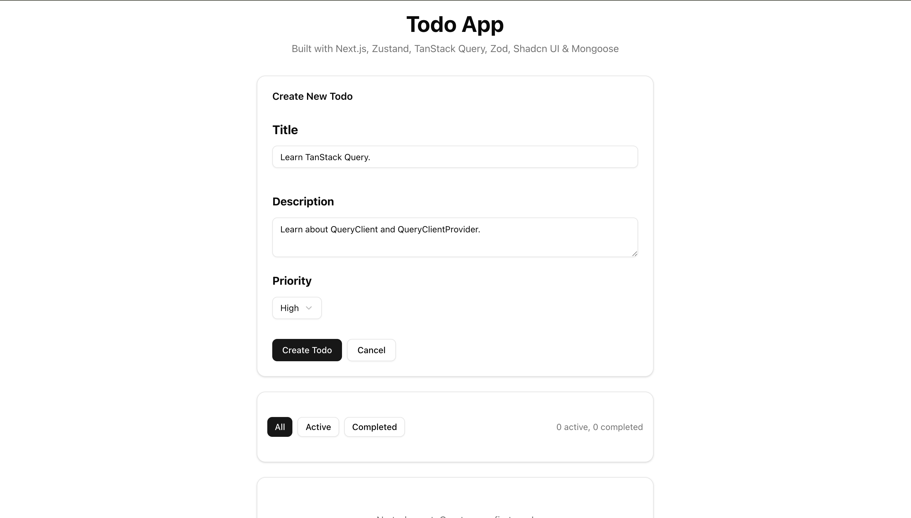
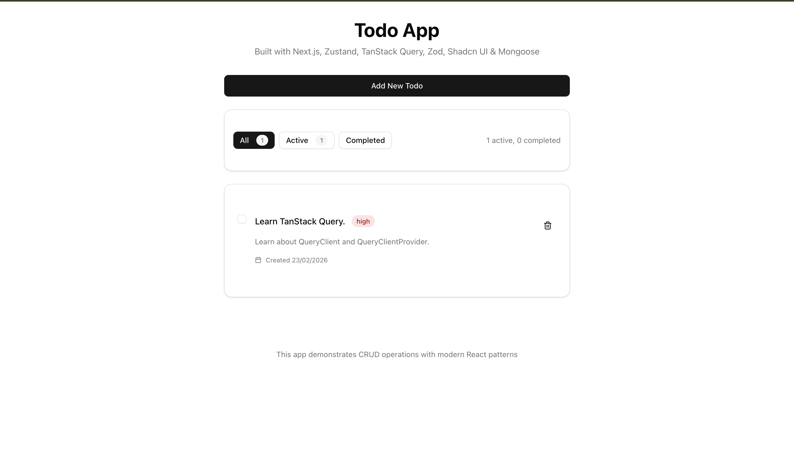
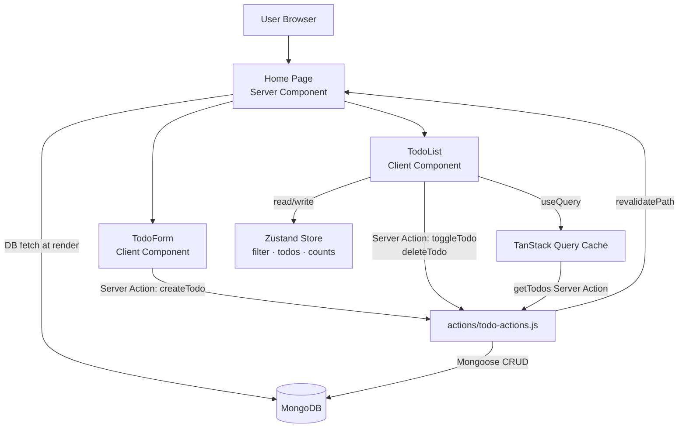

<h1 align="center">✅ Todo App</h1>

A clean, full-stack todo application built with **Next.js 16** and **MongoDB**. Create, complete, and delete todos with priority levels and real-time filtering — powered by **Server Actions**, **TanStack Query**, and **Zustand** for a modern, reactive experience.

### Visit [Todo App](https://todo-app-gmarav05.vercel.app/)

---


## 📋 Overview

Todo App is a production-ready task management application that demonstrates a modern **Next.js Server Actions + TanStack Query** architecture. Users can create todos with titles, descriptions, and priority levels, toggle their completion status, and filter by state — all with optimistic UI updates via Zustand and seamless server sync. A natural evolution from REST API patterns toward the full-stack server-first model.

---

## Live Demo


## Screenshot 

<div style="display: flex; justify-content: center; gap: 20px;">   
</div>

## 🌟 Features

### Core Functionality

- **Create Todos** — Add todos with a title, optional description, and priority (low / medium / high).

- **View All Todos** — Sorted newest-first with live count badges for active and completed items.

- **Toggle Completion** — Check or uncheck todos instantly with a single click.
- **Delete Todos** — Remove todos with a trash button; the UI updates immediately.
- **Priority Badges** — Color-coded badges (red / yellow / green) for visual priority scanning.
- **Toast Notifications** — Success and error feedback via `sonner` for every action.

### Technical Features

- **Server Actions** — All mutations (create, toggle, delete) go through typed Next.js Server Actions instead of REST endpoints.

- **TanStack Query** — Handles server state, caching, and background refetching for the todo list.
- **Zustand Store** — Manages client-side state (todos list, active filter) with `devtools` middleware for debugging.
- **Zod Validation** — Schema-level validation on both client (`react-hook-form` + `zodResolver`) and server (Server Action).
- **Shadcn UI** — Accessible, composable UI primitives (Card, Button, Checkbox, Badge, Select, etc.).
- **Mongoose Singleton** — Connection caching prevents duplicate connections across hot reloads in development.
- **React Compiler** — Enabled via `babel-plugin-react-compiler` for automatic memoization.

### UX Features
- **Filter Bar** — Filter todos by All / Active / Completed with live counts.
- **Responsive Design** — Mobile-first, centered layout that works on all screen sizes.
- **Dark Mode** — Full dark mode support via Shadcn's CSS variable theming system.
- **Empty States** — Friendly messages when no todos exist or none match the current filter.
- **Loading States** — Spinner while todos load; buttons disable during pending mutations.

---

## 📚 Learnings

- Learned how **Next.js Server Actions** work as a replacement for API routes — calling async server functions directly from Client Components without an explicit HTTP endpoint.
- Understood how to combine **TanStack Query** with Server Actions — using `useMutation` to call actions and `invalidateQueries` to trigger background refetches after mutations.
- Practiced the **dual-layer state pattern** — TanStack Query as the server state source of truth, and Zustand as the client state layer for instant UI responses (optimistic updates, filter state).
- Implemented **schema-driven validation** with Zod shared between client (`react-hook-form`) and server (Server Action), ensuring consistent rules without duplication.
- Explored **Shadcn UI's component model** — unstyled primitives with Tailwind variants, giving full control over design tokens via CSS variables.
- Learned to use `revalidatePath('/')` inside Server Actions to bust Next.js's server cache after mutations.
- Practiced **computed selectors in Zustand** — using `get()` inside the store to derive values like `activeCount` and `completedCount` without redundant state.

---

## 🏗️ Application Architecture



---

## 💻 Technology Stack

| Category | Technologies |
|----------|-------------|
| **Frontend Framework** | Next.js 16.1.6, React 19.2.3 |
| **Language** | JavaScript (JSX) |
| **Database** | MongoDB, Mongoose 9.2.1 |
| **Server Mutations** | Next.js Server Actions |
| **Server State** | TanStack Query v5 |
| **Client State** | Zustand v5 |
| **Validation** | Zod v4, React Hook Form |
| **UI Components** | Shadcn UI (Radix UI primitives) |
| **Styling** | Tailwind CSS v4, PostCSS |
| **Notifications** | Sonner |
| **Build Optimization** | React Compiler (babel-plugin-react-compiler) |
| **Fonts** | Geist, Geist Mono via next/font |

---

## 📁 Project Structure

```
todo-app/
├── actions/
│   └── todo-actions.js        # Server Actions — create, get, toggle, delete
├── app/
│   ├── layout.js              # Root layout — fonts + QueryProvider setup
│   ├── page.js                # Home page (Server Component, connects DB)
│   └── globals.css            # CSS variables, dark mode, Tailwind import
├── components/
│   ├── TodoForm.jsx           # Create todo form with validation
│   ├── TodoFilter.jsx         # All / Active / Completed filter bar
│   ├── TodoList.jsx           # List renderer with loading & empty states
│   ├── TodoItem.jsx           # Individual todo card with toggle & delete
│   └── providers/
│       └── QueryProvider.jsx  # TanStack QueryClient + Sonner Toaster
├── hooks/
│   └── UseCreateTodo.js       # useMutation & useQuery hooks for todos
├── store/
│   └── TodoStore.js           # Zustand store — todos, filter, counts
├── model/
│   └── todo.js                # Mongoose schema (title, desc, priority, completed)
├── validations/
│   └── todo.js                # Zod schema — shared client + server validation
├── lib/
│   ├── db.js                  # Mongoose singleton connection
│   └── utils.js               # cn() helper (clsx + tailwind-merge)
├── jsconfig.json              # Path aliases (@/*)
├── next.config.mjs            # Next.js config (React Compiler enabled)
├── components.json            # Shadcn UI config
└── package.json               # Dependencies
```

---

## 📊 Todo Model Schema

```js
{
  title:       String   // Required, max 100 characters
  description: String   // Optional, max 500 characters
  completed:   Boolean  // Default: false
  priority:    String   // Enum: "low" | "medium" | "high", default "medium"
  createdAt:   Date     // Auto-generated (timestamps: true)
  updatedAt:   Date     // Auto-updated  (timestamps: true)
}
```

---

## 🚀 Getting Started

### Prerequisites
- Node.js 18+
- A MongoDB connection string (MongoDB Atlas or local instance)

### Installation

```bash
# Clone the repository
git clone https://github.com/yourusername/todo-app.git
cd todo-app

# Install dependencies
npm install

# Set up environment variables
touch .env.local
```

### Environment Variables

Add the following to your `.env.local` file:

```env
MONGODB_URI=mongodb+srv://<user>:<password>@cluster.mongodb.net/tododb
```

### Run the Development Server

```bash
npm run dev
```

Open [http://localhost:3000](http://localhost:3000) to see the app.

---

## 🔧 Available Scripts

| Command | Description |
|---------|-------------|
| `npm run dev` | Start development server with hot reload |
| `npm run build` | Build optimized production bundle |
| `npm start` | Start production server |
| `npm run lint` | Run ESLint for code quality |

---

## Acknowledgments

- [Next.js](https://nextjs.org/) for the App Router and Server Actions
- [MongoDB Atlas](https://www.mongodb.com/atlas) for the managed database
- [Mongoose](https://mongoosejs.com/) for elegant MongoDB object modeling
- [TanStack Query](https://tanstack.com/query) for powerful server state management
- [Zustand](https://zustand-demo.pmnd.rs/) for lightweight client state
- [Zod](https://zod.dev/) for TypeScript-first schema validation
- [Shadcn UI](https://ui.shadcn.com/) for beautiful, accessible components
- [Sonner](https://sonner.emilkowal.ski/) for elegant toast notifications
- [Geist Font](https://vercel.com/font) by Vercel for the clean typography

##

<div align="center">

### 🛠️ Built With

**Next.js** • **React** • **MongoDB** • **TanStack Query** • **Zustand** • **Zod** • **Shadcn UI**

Stay productive, one task at a time.

</div>